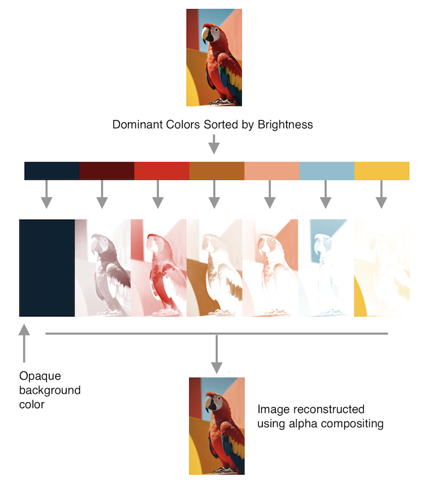

# layerbuilder

Image Layer Decomposition (Color segmentation) in pure Go

This implementation differs from the [original paper](https://arxiv.org/pdf/1701.03754), It produces alpha-composited layers, not additive layers.

This package was developed to meet the need for artistic halftone generation.



# Usage

```go
func main() {
	// Read the source image.
	img := utils.ReadImage("../_test_files/parrot.png")
	// Extract a 7-color palette using the dominant-color method.
	palette := utils.ExtractPalette(img, 7, utils.PaletteMethodDominantColor)
	// Sort palette colors from dark to bright for better results.
	utils.SortPaletteByBrightness(palette)

	// Create a new builder with the image and palette.
	builder := layerbuilder.NewLayerBuilder(img, palette)
	// Build internal layers using options derived from image size.
	builder.Build(layerbuilder.OptionsFromSize(img.Bounds().Size()))
	// Reconstruct an image from grayscale alpha layers.
	recon := builder.Reconstruct(builder.GrayLayers())

	// Save reconstructed image and debug outputs.
	utils.SaveImage(recon, "../_test_files/output/recon.png")
	utils.SavePalette(palette, 64, "../_test_files/output/palette.png")
	utils.SaveRgbaImages(builder.RGBALayers(), "../_test_files/output/")
}

```
